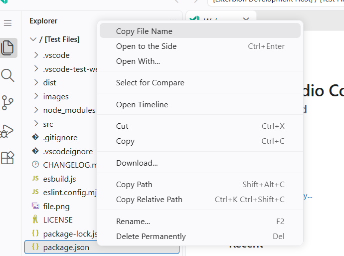
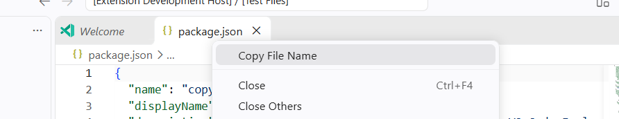

# Copy File Name (Faster)

Copy only a file or folder name from a VS Code context menu. No parent path, dialog, or notification is added.

## Use It

Right-click a file or folder in the Explorer, or an open editor tab, and select **Copy File Name**. Paste the result wherever you need it.

## How It Works

VS Code passes the selected resource URI to the command. The extension takes the final path segment, including for folders, then writes that name using VS Code's `vscode.env.clipboard.writeText()` API. It does not read or send file contents.

## Browser IDEs

The extension requires VS Code 1.89.1 or later, is bundled for the VS Code web extension host, and uses VS Code's clipboard API rather than Node.js or direct browser clipboard access. It is designed to work in desktop VS Code and compatible browser-hosted VS Code IDEs.

In an IDE such as Agentforce, clipboard writes still depend on the host exposing the required VS Code API and the browser allowing clipboard access. The host's extension and clipboard policies apply.

## Compared With Other Options

| Option | Clipboard result |
| --- | --- |
| **Copy File Name (Faster)** | Just the selected file or folder name |
| VS Code **Copy Path** | The absolute path |
| VS Code **Copy Relative Path** | The workspace-relative path |
| Select and copy text manually | The text you select inside an open file |

Use this extension when you need the name alone; use VS Code's path commands when the location is needed too.